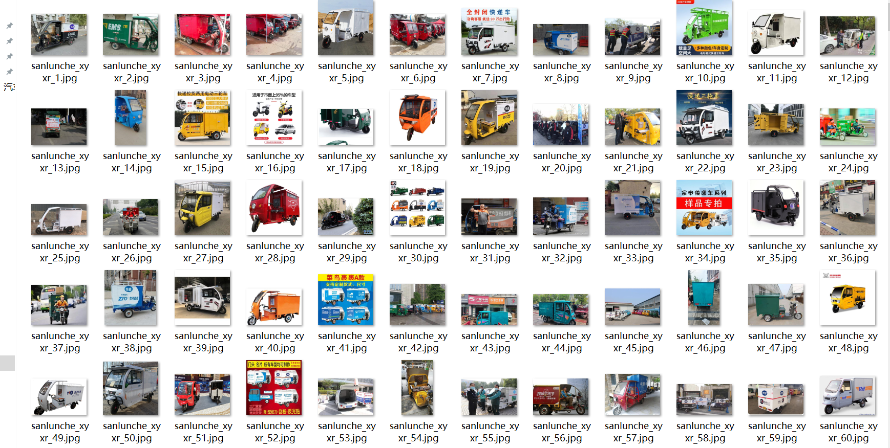
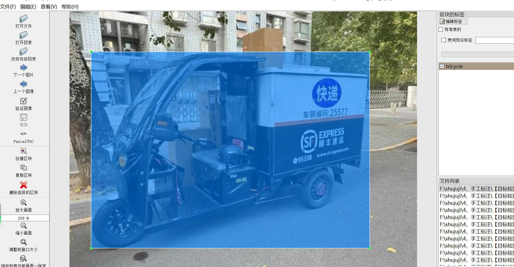
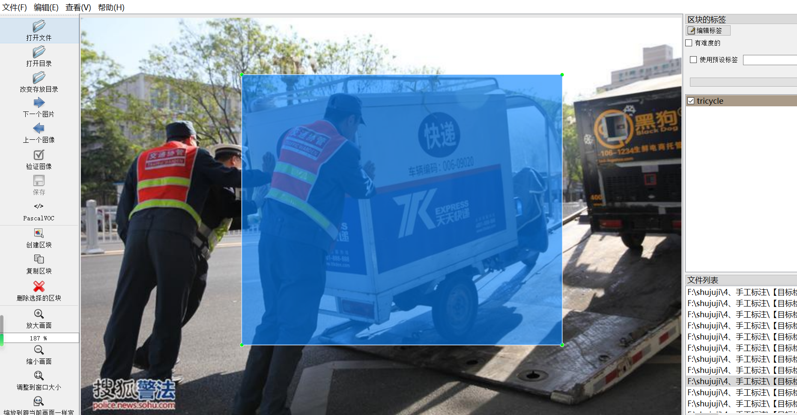
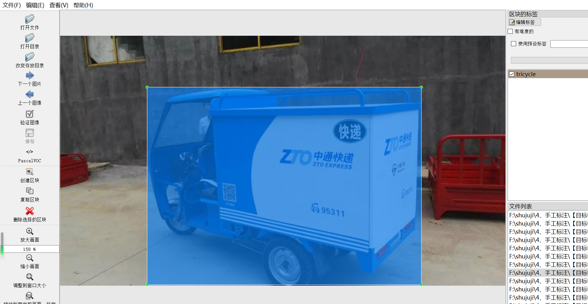

# [Object Detection Dataset] Express Tricycle Dataset (City Express Delivery of Goods Tricycle)
960 images in VOC+YOLO format

The dataset is organized in Pascal VOC format combined with YOLO format (excluding the segmentation path in txt files, only including jpg images and corresponding VOC format xml files and YOLO format txt files).

Number of images: 960

Number of annotations: 960

Number of annotations: 960

Number of annotation categories: 1

Annotation category name: ["tricycle"]

Number of bounding boxes per category:

Tricycle bounding box count = 1265

Total bounding boxes: 1265

Used annotation tool: labelImg

Important note: The images are collected from web crawling and manually labeled by themselves, which are original works and should not be copied without permission.

Image overview:

Annotation example:

## Images

---

Here is a pay link on Stripe (https://buy.stripe.com/3cs8yP7sY87d0vu9AB). Please contact me lonlonago@foxmail.com after funding $89, and I will send you a complete data files, thank you!

